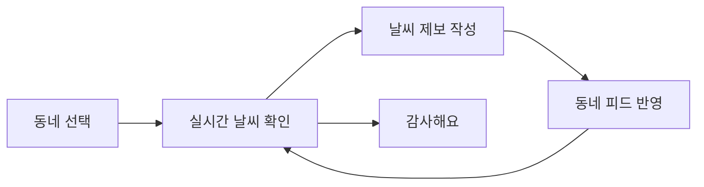

  
  <h1>날씨로그</h1>
  

    예보보다 가까운, 이웃이 직접 전하는 지금 날씨
  

  

    <a href="https://nalssilog.com"><strong>날씨로그 바로가기</strong></a>
  

## 어떤 서비스인가요?

날씨로그는 같은 동네의 이웃들이 직접 느낀 날씨를 사진과 함께 공유하는 모바일 웹 서비스입니다.
숫자로 표시된 예보만으로 알기 어려운 체감온도, 비, 햇빛 상태를 최근 제보로 빠르게 확인할 수 있습니다.

## 서비스 미리보기

  

### 동네 날씨 피드

- GPS 또는 동네 검색으로 현재 지역 설정
- 최근 24시간 날씨 제보를 사진 중심의 2열 피드로 제공
- 체감온도·강수·햇빛 통계와 10초 주기 자동 갱신
- 이웃의 제보에 `감사해요` 반응

### 날씨 제보

- 체감온도·비·햇빛 상태를 고르는 간단한 2단계 작성 흐름
- 사진을 최대 3장까지 첨부하고 업로드 전에 자동 최적화
- 현재 동네와 짧은 날씨 이야기를 함께 공유

### 프로필

- 내가 작성한 제보를 한눈에 확인하는 3열 그리드
- 기본 프로필과 커스텀 프로필 사진 지원
- 닉네임, 소셜 계정 연동과 회원 정보 관리

## 사용자 흐름

## 기술 구성

- Next.js App Router
- TypeScript
- Tailwind CSS
- TanStack Query
- Zustand
- React Hook Form · Zod
- Spring Boot API
- Cloudflare R2
- Vercel
